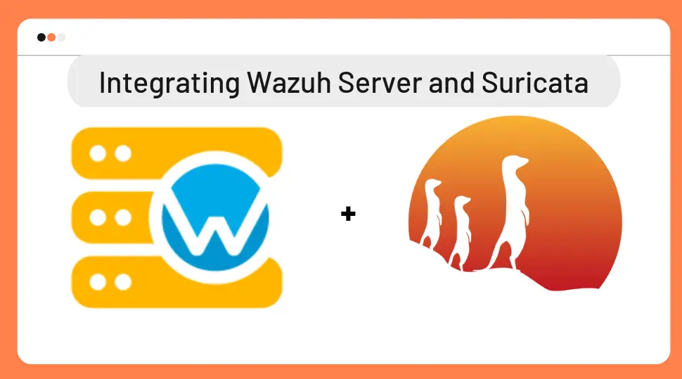

# WazuhSuricata
Wazuh là một nền tảng mã nguồn mở dùng để giám sát an ninh, phát hiện xâm nhập (HIDS), và quản lý sự kiện tập trung. Nó thu thập log, phân tích hành vi, và đưa ra cảnh báo bảo mật từ các endpoint trong hệ thống.

Suricata là một công cụ phát hiện và ngăn chặn xâm nhập mạng (IDS/IPS) mạnh mẽ, có khả năng phân tích gói tin theo thời gian thực, phát hiện các mối đe dọa dựa trên rule.

Kết hợp Wazuh và Suricata giúp tạo ra một hệ thống giám sát an ninh toàn diện, vừa theo dõi hoạt động trên endpoint, vừa phát hiện các tấn công từ mạng, nâng cao khả năng phòng thủ cho tổ chức.

# Thiết lập Wazuh và Suricata
## Wazuh
__Cài đặt Wazuh__  
Cấu hình tối thiểu:  
CPU: 4 vCPU  
RAM: 8 GiB  
Dung lượng (Storage): 50 GB  
Số lượng Agents: từ 1-25  
  
Dùng QuickStart (All-in-one) để cài đặt Wazuh bản mới nhất 4.12:  
__curl -sO https://packages.wazuh.com/4.12/wazuh-install.sh && sudo bash ./wazuh-install.sh -a__  
Các thành phần sẽ được cài đặt khi dùng lệnh QuickStart: Wazuh Manager, Wazuh API, Elasticsearch, Filebeat, Wazuh Dashboard  
  
Truy cập vào dashboard Wazuh: __https://<ip-server>:443__

