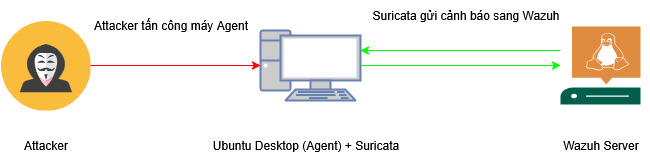
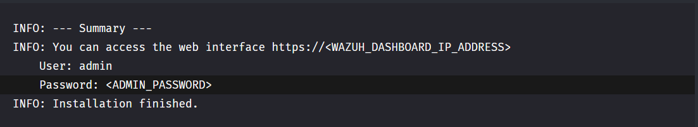
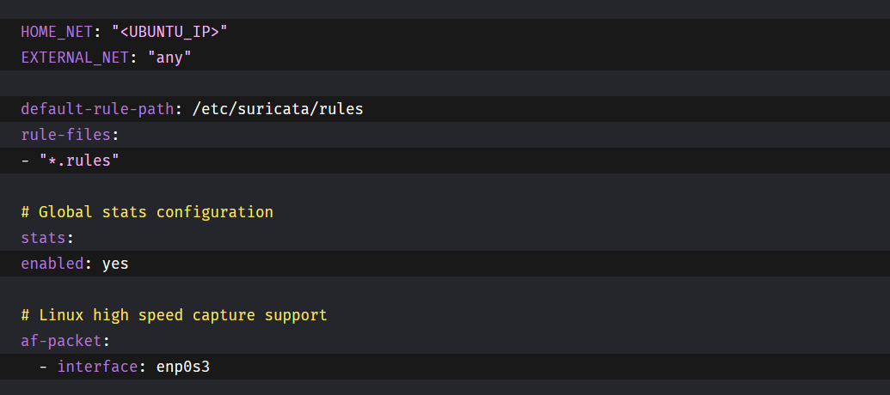
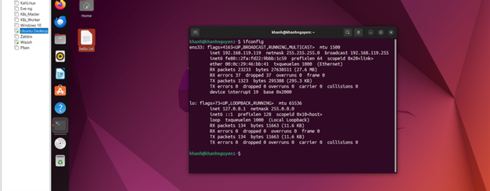
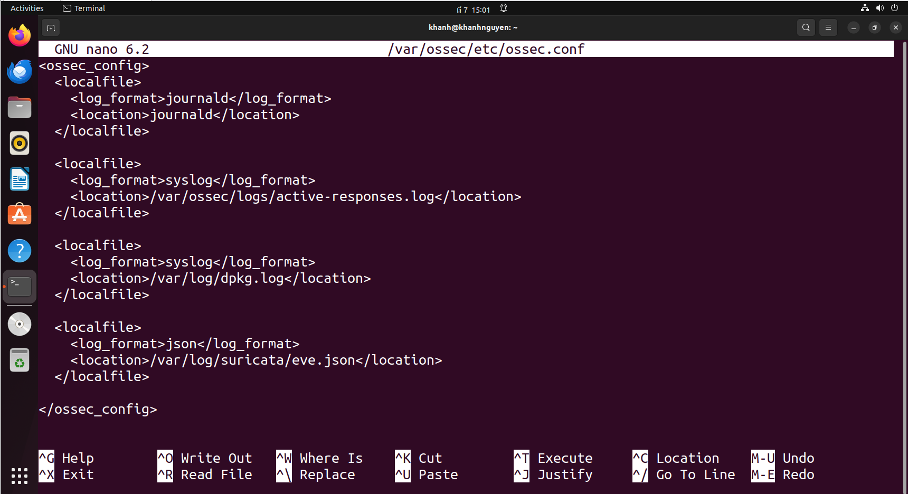

# Wazuh tích hợp với Suricata
Wazuh là một nền tảng mã nguồn mở dùng để giám sát an ninh, phát hiện xâm nhập (HIDS), và quản lý sự kiện tập trung. Nó thu thập log, phân tích hành vi, và đưa ra cảnh báo bảo mật từ các endpoint trong hệ thống.

Suricata là một công cụ phát hiện và ngăn chặn xâm nhập mạng (IDS/IPS) mạnh mẽ, có khả năng phân tích gói tin theo thời gian thực, phát hiện các mối đe dọa dựa trên rule.

Kết hợp Wazuh và Suricata giúp tạo ra một hệ thống giám sát an ninh toàn diện, vừa theo dõi hoạt động trên endpoint, vừa phát hiện các tấn công từ mạng, nâng cao khả năng phòng thủ cho tổ chức.

  
# Luồng dữ liệu giữa Suricata và Wazuh

  
# Thiết lập Wazuh và Suricata
## Wazuh
__Cài đặt Wazuh__  
Cấu hình tối thiểu:  
CPU: 4 vCPU  
RAM: 8 GiB  
Dung lượng (Storage): 50 GB  
Số lượng Agents: từ 1-25  
  
Dùng QuickStart (All-in-one) để cài đặt Wazuh bản mới nhất 4.12:  
__curl -sO https://packages.wazuh.com/4.12/wazuh-install.sh && sudo bash ./wazuh-install.sh -a__  
Các thành phần sẽ được cài đặt khi dùng lệnh QuickStart: Wazuh Manager, Wazuh API, Elasticsearch, Filebeat, Wazuh Dashboard  
__*Lưu ý__: dùng QuickStart dành cho mục đích học tập và mô phỏng. Không khuyến nghị dùng cho production lớn  
Khi cài đặt thành công sẽ có thông tin để đăng nhập Wazuh Dasboard:  
  

    
Truy cập vào dashboard Wazuh: __https://(ip-server):443__  
  
## Suricata  
__Cài đặt Suricata và tích hợp với Wazuh__  
Cài đặt Suricata tại máy Agent mà Wazuh đã đặt:  
sudo add-apt-repository ppa:oisf/suricata-stable  
sudo apt-get update  
sudo apt-get install suricata -y  

Tải và giải nén bộ rule Emerging Threats Suricata:  
cd /tmp/ && curl -LO https://rules.emergingthreats.net/open/suricata-6.0.8/emerging.rules.tar.gz  
sudo tar -xvzf emerging.rules.tar.gz && sudo mkdir /etc/suricata/rules && sudo mv rules/*.rules /etc/suricata/rules/  
sudo chmod 640 /etc/suricata/rules/*.rules  

Cấu hình /etc/suricata/suricata.yaml:  
  

*Note:  
"<UBUNTU_IP>": Đặt IP theo máy Agent  
interface: enp0s3 : Đặt card mạng đúng với máy của Agent. Kiểm tra bằng lệnh ifconfig (Máy agent của tôi là ens33)
  
Khi cấu hình xong khởi động lại Suricata: sudo systemctl restart suricata  
  
Tiếp theo để Suricata có thể gửi log đến cho Wazuh, tại Wazuh Agent vào /var/ossec/etc/ossec.conf để cấu hình:  
  
  
Khởi động lại Wazuh agent để áp dụng cấu hình: sudo systemctl restart wazuh-agent  
  
## Kiểm tra Suricata đã có thể gửi log qua Wazuh
Dùng lệnh Ping sang máy Agent: ping -c 20 "<UBUNTU_IP>"  
Vào Dashbroad Wazuh chọn Agent đã tích hợp Suricata chọn Threat Hunting -> vào Event -> dùng rule.groups:suricata để lọc  
